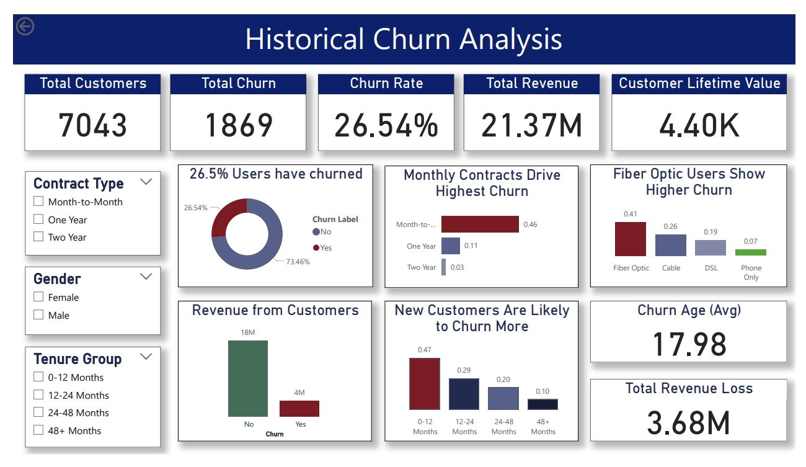

#  IBM Customer Churn Analysis | Power BI Dashboard

##  Project Overview

Customer churn is one of the most critical challenges for subscription-based businesses. This project analyzes customer behavior, service usage patterns, and revenue impact to identify key churn drivers and uncover actionable retention strategies.

Using Power BI, an end-to-end interactive dashboard was built to transform raw data into business insights, enabling stakeholders to monitor churn, identify high-risk customers, and take proactive decisions.

---

## Dataset Source

This project uses the IBM Telco Customer Churn dataset, a widely recognized industry dataset for churn analysis.

Source:
 [IBM Analytics Accelerator – Customer Churn Dataset](https://accelerator.ca.analytics.ibm.com/bi/?perspective=authoring&pathRef=.public_folders%2FIBM%2BAccelerator%2BCatalog%2FContent%2FDAT00148&id=i9710CF25EF75468D95FFFC7D57D45204&objRef=i9710CF25EF75468D95FFFC7D57D45204&action=run&format=HTML&cmPropStr=%7B%22id%22%3A%22i9710CF25EF75468D95FFFC7D57D45204%22%2C%22type%22%3A%22reportView%22%2C%22defaultName%22%3A%22DAT00148%22%2C%22permissions%22%3A%5B%22execute%22%2C%22read%22%2C%22traverse%22%5D%7D)

About the dataset:

Contains customer demographics, services, and billing details
Used to analyze churn behavior in a telecom business context
Commonly used for analytics, BI dashboards, and ML models

Alternative Source: Kaggle (IBM Telco Churn Dataset)

---


##  Business Problem

The company is experiencing significant customer churn, leading to revenue loss and reduced customer lifetime value. However, the drivers behind churn are unclear.

**Key Questions Addressed:**

* Who are the customers most likely to churn?
* What factors contribute most to churn?
* How much revenue is at risk?
* Where should the business focus its retention efforts?

---

##  Key Insights

*  **Churn Rate:** 26.54% - indicating a high retention risk
*  **Revenue Loss:** $3.68M due to churn
*  **High-Risk Customers:** 991 customers contributing to $1.05M potential revenue loss


###  Major Drivers of Churn:

* Month-to-month contracts show the highest churn (~46%)
* Customers in the first 12 months are most vulnerable (~47%)
* Lack of Online Security & Tech Support significantly increases churn
* Fiber optic users exhibit higher churn despite higher value
* Customers without dependents or long-term commitments are more likely to leave

---

##  Dashboard Highlights

The Power BI report is divided into multiple analytical views:

* **KPI Overview:** High-level metrics (Customers, Churn Rate, Revenue)
* **Demographics Analysis:** Churn patterns across customer segments
* **Service Analysis:** Impact of service usage on churn behavior
* **Location Analysis:** Geographic distribution of churn and revenue loss
* **Risk Analysis:** Identification of high-risk customers and revenue exposure

---

##  Key Features

* Interactive and dynamic dashboards with slicers & drill-downs
* Advanced DAX measures for churn rate, CLTV, and risk scoring
* Risk-based customer segmentation
* Revenue impact analysis for better decision-making

---

##  Tools & Technologies

* **Power BI** – Data visualization & dashboarding
* **DAX (Data Analysis Expressions)** – Calculated measures and KPIs
* **Excel / CSV** – Data source
* **Data Modeling** – Star schema design

---

##  Dashboard Preview



---

##  Project Structure

```
IBM-Churn-Analysis/
│
├── Dashboard/
├── Report/
├── Dataset/
├── Images/
└── README.md
```

---

##  How to Use

1. Download the `.pbix` file from the repository
2. Open using Power BI Desktop
3. Use slicers and filters to explore insights
4. Navigate across different dashboard pages

---

##  Business Recommendations

* Convert customers to long-term contracts using incentives
* Improve onboarding experience for new customers
* Bundle value-added services (Security & Tech Support)
* Implement risk-based retention strategies
* Focus on high-churn geographic regions

---

## Future Enhancements

* Integrate real-time data pipelines
* Apply machine learning models for churn prediction
* Enhance segmentation using behavioral analytics
* Deploy dashboard for enterprise-level usage

---

## About This Project

This project demonstrates how data analytics and visualization can be leveraged to solve real-world business problems and drive strategic decision-making.

---
